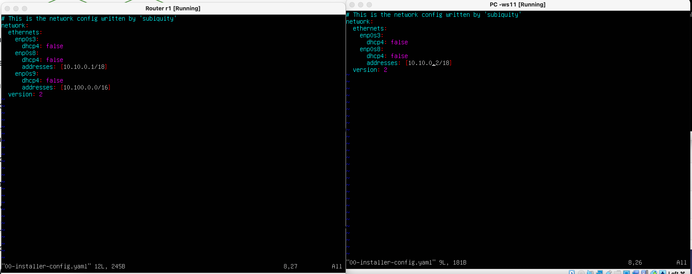

## Part 1. ipcalc tool
### 1.1. Networks and Masks
* Network address of 192.167.38.54/13

#### Conversion:
* mask 255.255.255.0 prefix and binary 

* /15 to normal and binary

* 11111111.11111111.11111111.11110000 to normal and prefix

#### Minimum and maximum host
* 12.167.38.4/8

* 11111111.11111111.00000000.00000000

* 255.255.254.0/4

### 1.2. localhost
* WTF?
### 1.3. Network ranges and segments

* IPs can be used as public: 172.20.250.4, 172.0.2.1,  192.172.0.1, 172.68.0.2, 192.169.168.1
* IPs can be used as private: 10.0.0.45, 134.43.0.2, 192.168.4.2, 172.16.255.255, 10.10.10.10
* IP addresses for 10.10.0.0/18 network: 10.0.0.1, 10.10.0.2, 10.10.10.10, 10.10.1.255

## Part 2. Static routing between two machines
* Run `ip a` command
![Part_2_1]
* Set the following addresses and masks: ws1 - 192.168.100.10, mask */16 *, ws2 - 172.24.116.8, mask /12

* Run `netplan apply` command to restart the network service

### 2.1. Adding a static route manually
* Adding route using `ip r add` command

* Ping mascines

### 2.2. Adding a static route with saving

* Ping mascines

## Part 3. iperf3 utility
### 3.1. Connection speed
* 8 Mbps =  1 MB/s
* 100 MB/s =  100000 Kbps
* 1 Gbps = 1000 Mbps
### 3.2. iperf3 utility

## Part 4. Network firewall
### 4.1 iptables utility
* /etc/firewall.sh file simulating the firewall on ws1 and ws2

### 4.2 nmap utility

## Part 5. Static network routing
### 5.1. Configuration of machine addresses
* etc/netplan/00-installer-config.yaml according to the network in the picture

* ping ws22 from ws21. Similarly ping r1 from ws11

### 5.2. Enabling IP forwarding
* Enable IP forwarding using `sysctl -w net.ipv4.ip_forward=1` command

* to /etc/sysctl.conf file added `net.ipv4.ip_forward = 1` to enabled permanently IP forwarding.

### 5.3. Default route configuration
* The default route (gateway) for the workstations configured

* `ip r` called 

* ping r2 router from ws11 and show on r2 that the ping is reaching using `tcpdump -tn -i eth1` command

### 5.4. Adding static routes
* static routes to r1 and r2 in configuration file added

* `ip r` called 

* `ip r list 10.10.0.0/[netmask]` and `ip r list 0.0.0.0/0` commands on ws11 ran
